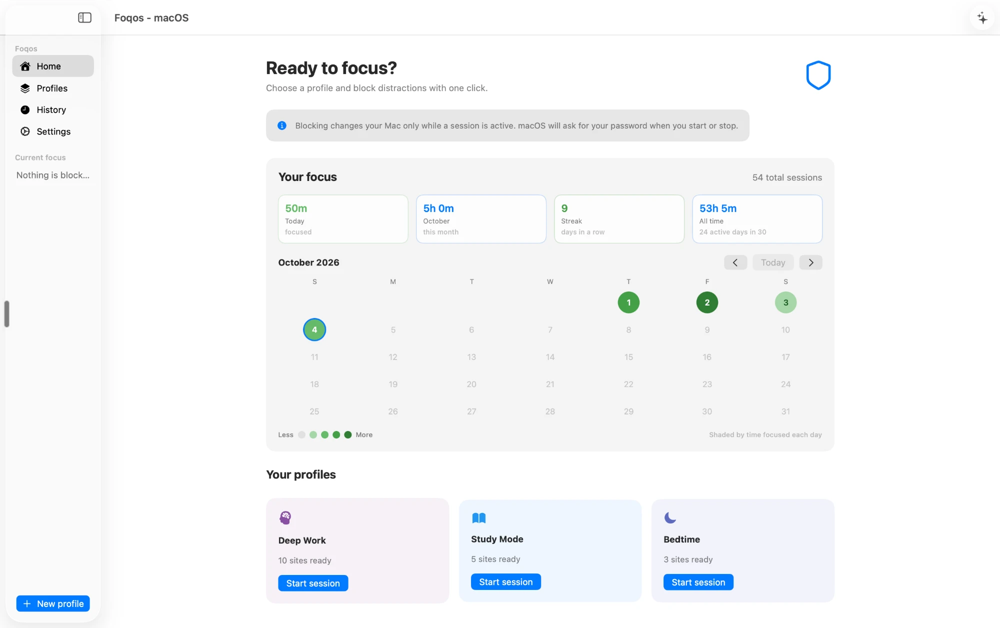
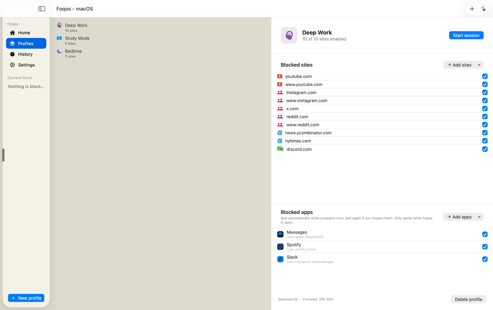
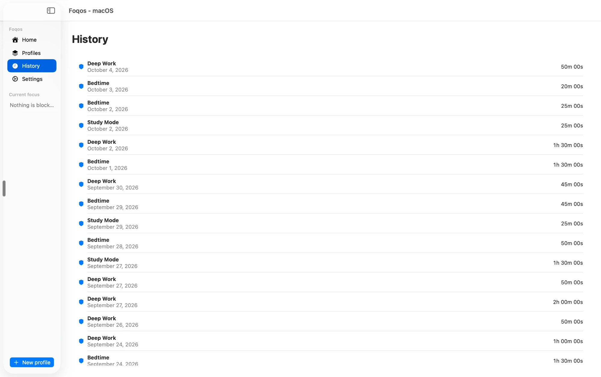
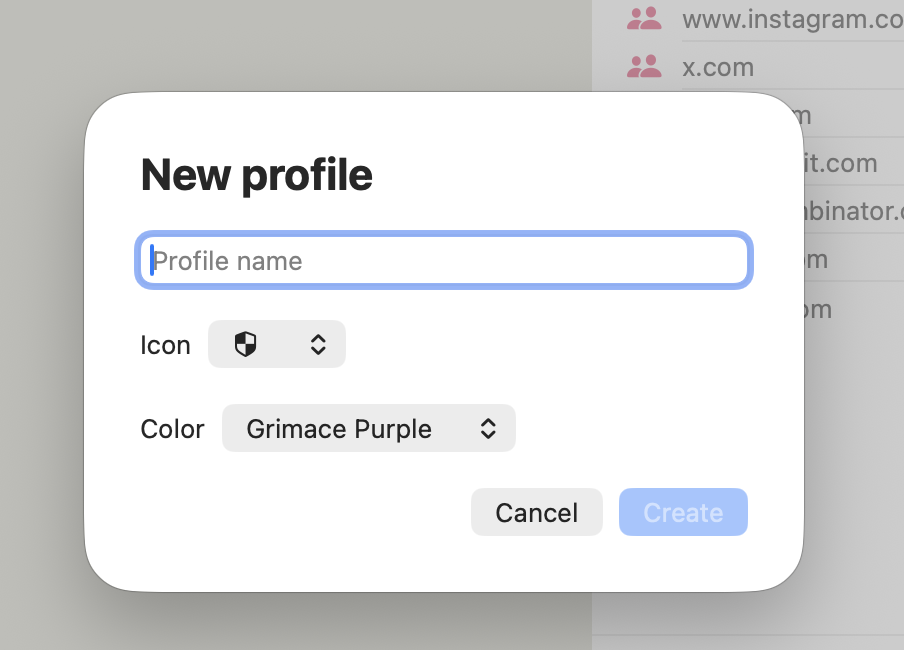
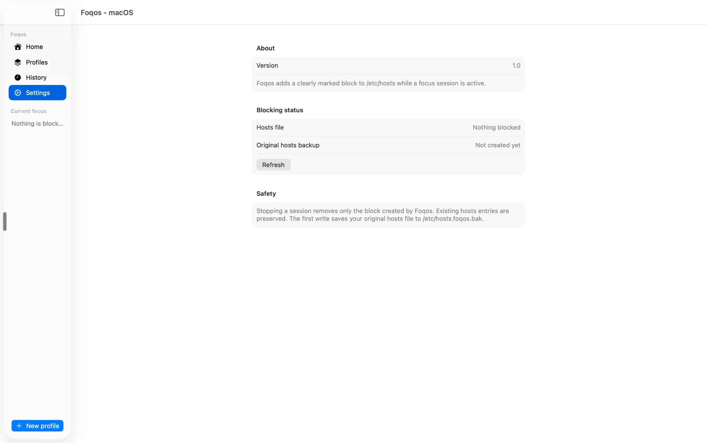

<p align="center">
  
</p>

<h1 align="center">Foqos for Mac</h1>

<p align="center">
  A Mac version of <a href="https://github.com/awaseem/foqos"><b>Foqos</b></a>, the free, open-source focus app created by <a href="https://github.com/awaseem"><b>Ali Waseem</b></a>.<br>
  All credit for Foqos, its idea and its iPhone app goes to Ali.
</p>

<p align="center">
  
</p>

## Why I made this

I've used and enjoyed Foqos on my phone for a while. Most of my actual work happens on my computer, though, and that's where I lose the most time to a stray tab. I wanted the same kind of focus session on my Mac, so I built one. This is me filling that gap for myself, not a replacement for the original.

## What it does

- **Profiles** for different modes, like Deep Work, Study Mode and Bedtime, each with its own sites and apps
- **Blocks websites** for as long as a session runs
- **Quits distracting apps** if you open them mid-session
- **Tracks your focus** with a calendar shaded by how long you focused each day
- **Starts from the menu bar** in one click

## Screenshots

<table>
  <tr>
    <td width="50%"><br><sub><b>A profile:</b> the sites and apps it blocks</sub></td>
    <td width="50%"><br><sub><b>History:</b> every session and how long it lasted</sub></td>
  </tr>
  <tr>
    <td width="50%"><br><sub><b>New profile:</b> a name, an icon and a color</sub></td>
    <td width="50%"><br><sub><b>Settings:</b> whether anything is blocked right now</sub></td>
  </tr>
</table>

## How it works

Sites are blocked by adding a clearly marked section to `/etc/hosts`, so macOS asks for your password when a session starts and stops. Apps are asked to quit while Foqos is open. Everything stays on your Mac.

It's a roadblock, not a jail. A tab that was already open before the session started can keep working until you close it.

## Build it

There's no download yet. To build it yourself you need Xcode 26.5 or later and macOS 26.3 or later.

```bash
git clone https://github.com/milomaurer23/foqos-for-mac.git
open "foqos-for-mac/Foqos - macOS/Foqos - macOS.xcodeproj"
```

Then press **Run** in Xcode.

---

## The original Foqos (iPhone)

[Foqos](https://github.com/awaseem/foqos) by [Ali Waseem](https://github.com/awaseem) is a free, open-source iPhone app that blocks distracting apps and websites using Apple's Screen Time. You can start a session by tapping an NFC tag, scanning a QR code, setting a timer or tapping a button. There's no account, no ads and no subscription.

- [Download it on the App Store](https://apps.apple.com/ca/app/foqos/id6736793117)
- [foqos.app](https://www.foqos.app/)
- [Source code](https://github.com/awaseem/foqos)
- [Support Ali's work](https://coff.ee/ambitionsoftware)

This repo is a fork of Ali's, so the iPhone source is still here. Its full original README is in [docs/IOS_README.md](docs/IOS_README.md).

## License

MIT, same as the original Foqos. See [LICENSE](LICENSE).
